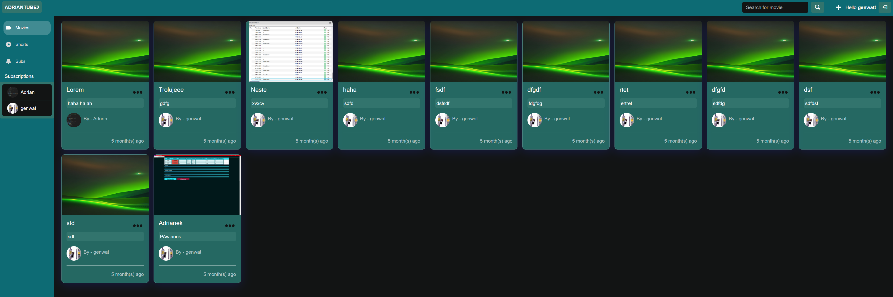
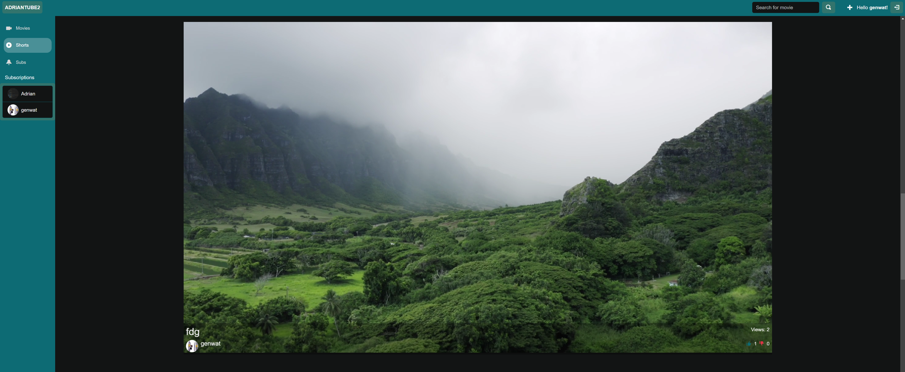
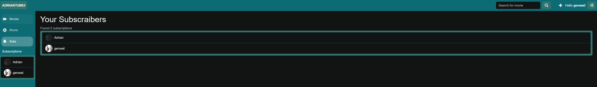
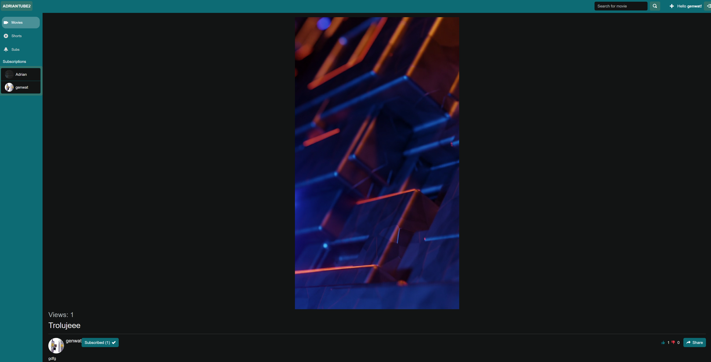
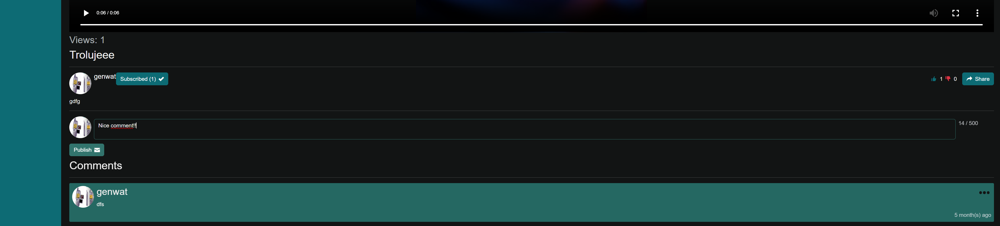

# AdrianTube2

## This is movie app when you can add movie or short, comment, like, dislike, subscribe and view them.

## To run this app you need to:
* Clone this repo
* AdrianTube2 is using authentication from [AdrianAuthServer](https://github.com/GenWatt/AdrianAuthServer) and [AdrianAuthClient](https://github.com/GenWatt/AdrianAuthClient) so to be able to make an account you should setup this apps first.
* Make .env file, this is a sample how you should do it [.env.sample](./.env.sample)
* Then you can use `dotnet run` command

## This app use:
* Mongodb database
* Blazor Server
* AdrianAuth authentication app

## Overview

### Main page 

### Shorts page

### Subscraibers page

### Checkout creator page and his videos

### Watch video 

### Comment videos!

### Add videos

### Manage your videos

### Search for videos 

